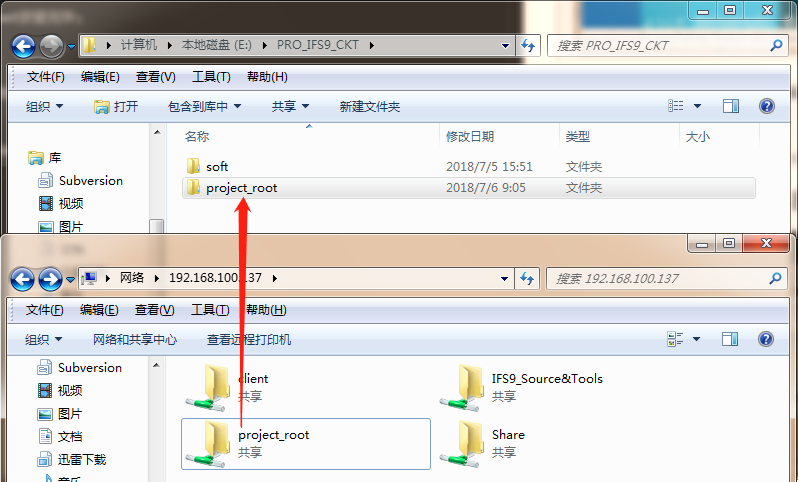
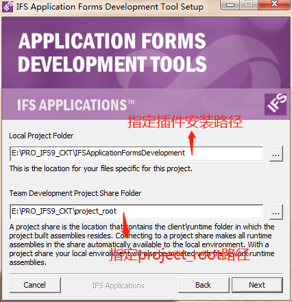
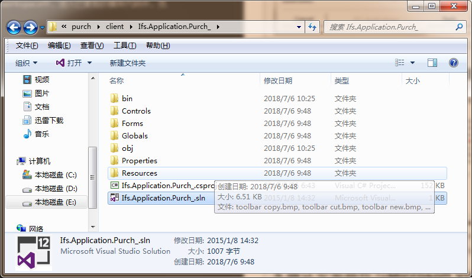
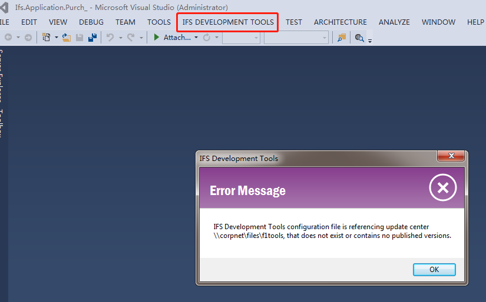

  
  
  
- [1. 必要软件列表](#1-必要软件列表 )
- [2. 后台开发工具安装](#2-后台开发工具安装 )
- [3. 前台开发工具安装](#3-前台开发工具安装 )
        - [3.1. 修改C:\Windows\System32\drivers\etc\host 文件](#31-修改c/windows/system32/drivers/etc/host-文件 )
        - [3.2. 安装Microsoft Visual Studio 2013](#32-安装microsoft-visual-studio-2013 )
        - [3.3. 将开发服务器共享的project_root文件夹复制到本地](#33-将开发服务器共享的project_root文件夹复制到本地 )
        - [3.4. 安装IFS前台开发插件→IFSApplicationFormsDevelopment](#34-安装ifs前台开发插件→ifsapplicationformsdevelopment )
        - [3.5. 确认安装插件与Microsoft Visual Studio 2013匹配](#35-确认安装插件与microsoft-visual-studio-2013匹配 )
  
  
  
# 1. 必要软件列表
  
>* IFSApplicationFormsDevelopment
>* IFSDeveloperStudio
>* Microsoft Visual Studio 2013（英文版）
  

  
****
# 2. 后台开发工具安装
  
>### 安装IFSDeveloperStudio，一路Next安装完毕。
>**注意事项：**
>*1.需要先安装Java环境；*
>*2.由于软件是64位所以要求操作系统为64位。*
>*3.本次数据库实例名（PROD9）*
  
****
# 3. 前台开发工具安装
  
### 3.1. 修改C:\Windows\System32\drivers\etc\host 文件
  
>将host文件追加开发服务器地址信息，例如本次追加:192.168.100.137 win-8g8oqsp7hb9
>
>打开浏览器，通过输入机器名确认可以访问上一步中配置的开发服务器名 http://win-8g8oqsp7hb9/
>
  
### 3.2. 安装Microsoft Visual Studio 2013
  
>执行安装文件，一路Next安装完毕
  
### 3.3. 将开发服务器共享的project_root文件夹复制到本地
  
>
  
### 3.4. 安装IFS前台开发插件→IFSApplicationFormsDevelopment
  
>运行安装程序文件 SetupIFSAPFDevelopment90.exe，如果误杀请添加信任，参照下图路径设置后一路Next安装完毕
>
>安装完毕后修改配置文件IFSApplicationFormsDevelopment\project.config TeamServerProjectRoot内容改为开发服务器的共享位置
>
>运行同步工具Reset Deploy Files from Team Server，Update Deploy Files from Team Server，如果同步成功则代表安装设置成功，如果出现异常，需要检查Logfiles中的log文件，排除异常后再次同步
  
### 3.5. 确认安装插件与Microsoft Visual Studio 2013匹配
  
>复制一个功能模块代码到文件夹 \IFSApplicationFormsDevelopment\workspace中，进入已复制的模块代码中，找到一个VS工程文件，使用VS 2013打开，如下图出现IFS DEVELOPMENT TOOLS则插件与VS 2013匹配成功，图中错误信息可以无视
>
>
>**注意事项：**
>*需要安装``.``NET Framework 4.5.2环境*
  
****
  