# 1. GitHub使用概述
* 安装Git客户端软件
* 安装GitHub客户端软件
* 注册GitHub账号，并将该账号发送给ljlu@ichengsi.com，用于增加团队合作开发信息（不增加只能看不能改）
* 注册后需要去邮箱认证，并且时刻关注邮件信息，增加团队开发信息后会生成邀请信息，接受邀请
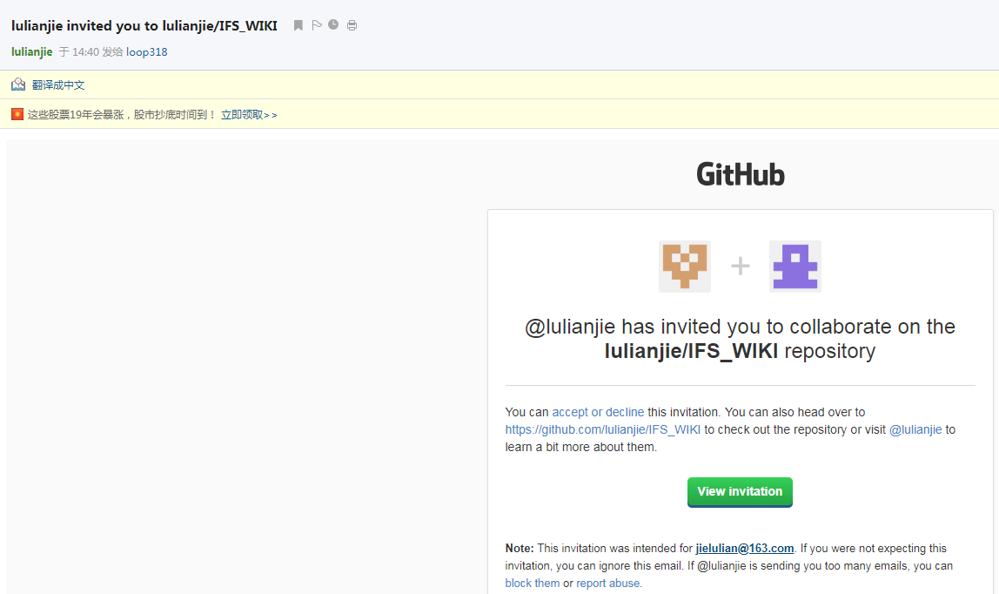
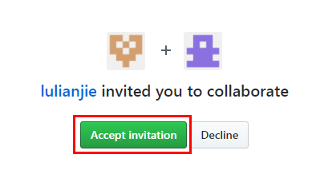
* 使用GitHub客户端克隆远程仓库到本地仓库
  File-->Clone repository-->URL
  远程仓库地址: https://github.com/lulianjie/Training.git
  Local path: 指定到后台开发工具创建好的IFS项目目录中,替换workspace文件夹。如图所示,我将已有的workspace备份为workspace_bak，然后克隆Training项目到本地，名字变更为workspace。
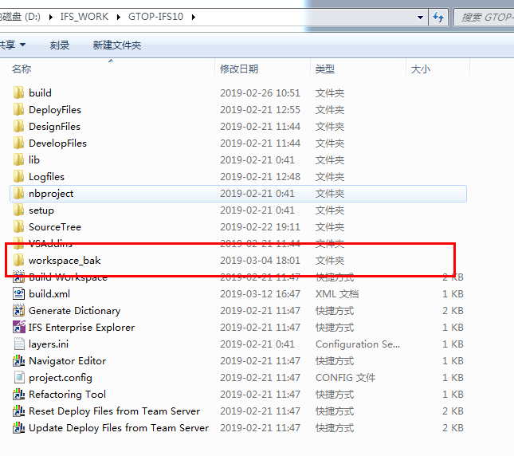
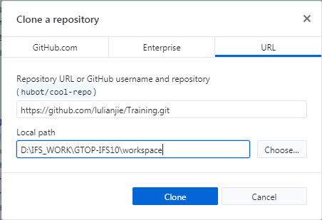
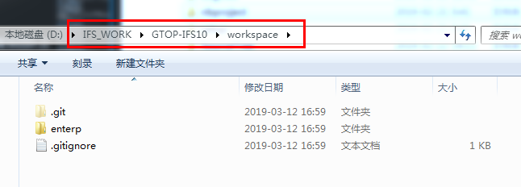
* 修改任意代码文件，测试GitHub客户端软件使用
  修改代码后切换到GitHub客户端，我们变更的代码自动刷新并列出变更的内容，这是添加注释后点击Commit to master，则本地代码仓库发生变更
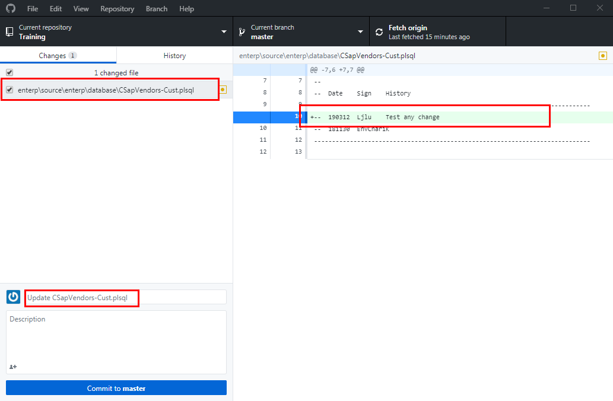
* 这时，Push origin按钮点亮，提示我们有一次提交没有和远程仓库同步，我们点击Push origin按钮将代码上传到远程仓库。
 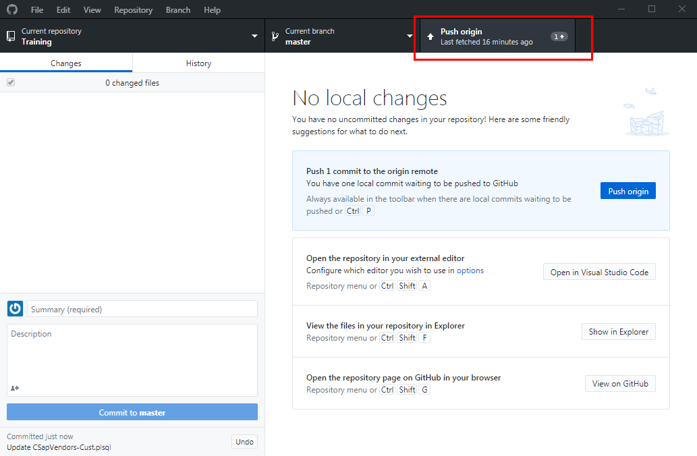
* 我们可以在History中查看所有的修改记录。
 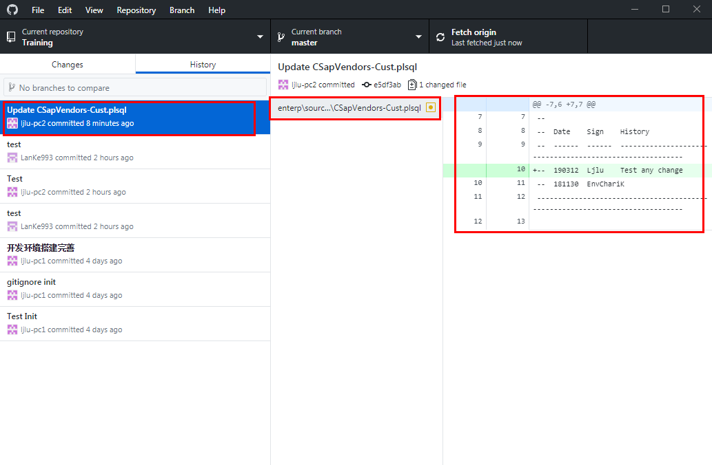


# 2. 华为云相关说明
### 2.1 华为云访问地址
https://dl.devcloud.huaweicloud.com/home ，输入公司账号密码登录

### 2.2 找到要查看的代码仓
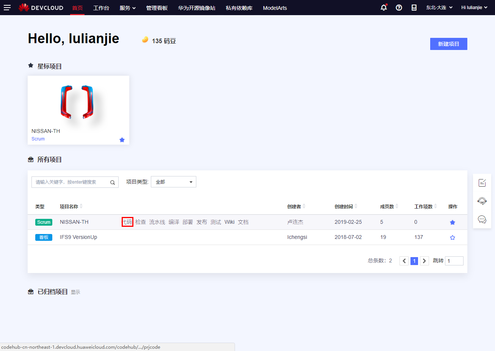
### 2.3 设置登录账号的SSH密匙
一个账号可以允许多个SSH访问


### 2.4 选择具体的代码仓库
选择SSH访问方式，将对应的Git地址复制出来，用于后续步骤克隆（2.3）
本例中地址为：git@codehub-cn-northeast-1.devcloud.huaweicloud.com:NISSAN-TH00001/workspace.git
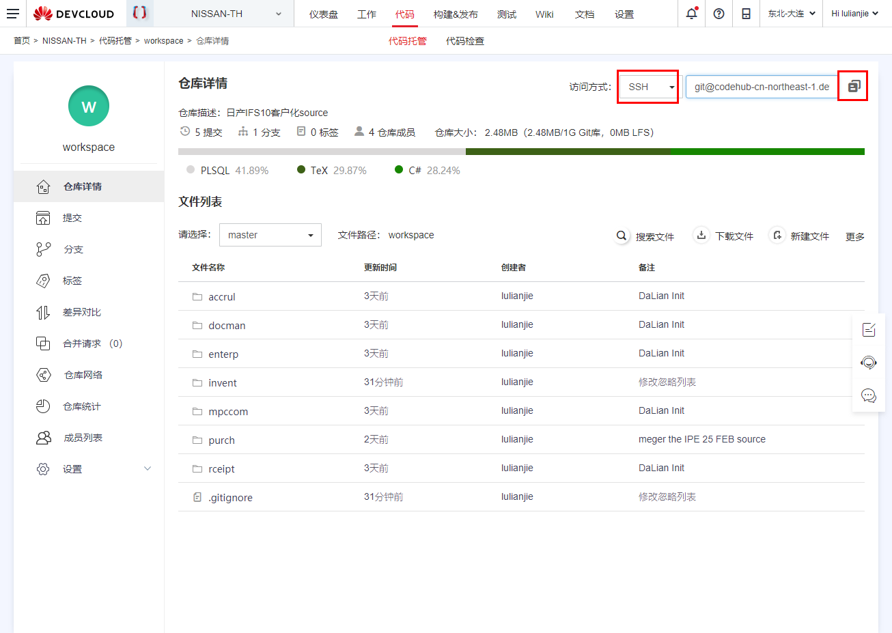

# 3.Git客户端软件说明，本例以Sourcetree软件为例介绍
### 3.1 打开软件，启动SSH助手
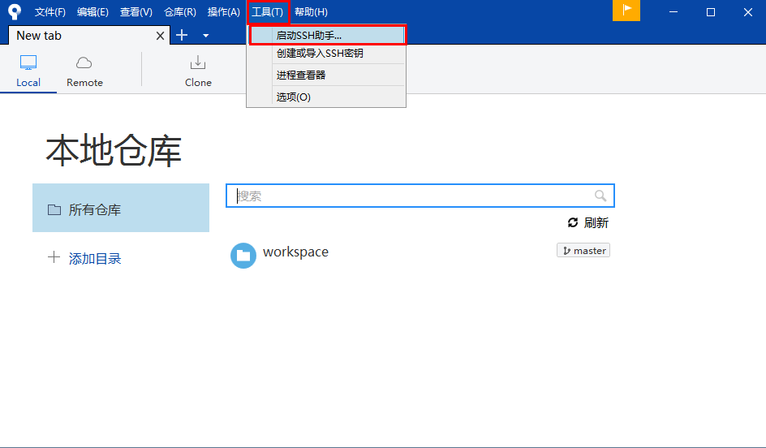
### 3.2 任务栏右键PuTTY添加SSH密匙
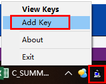
***

***
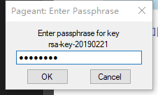
***

### 3.3 克隆Git仓库中代码到本地环境

***
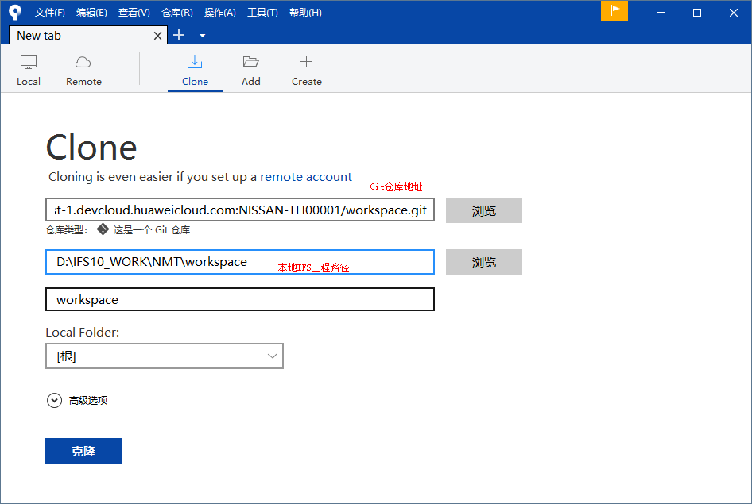
***
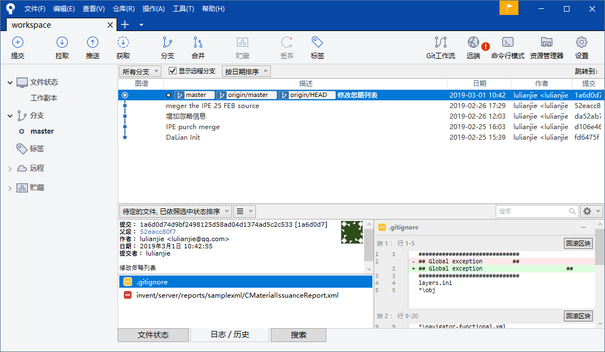
### 3.4 修改默认作者，用于区分代码归属

### 3.5 更多Sourcetree操作请参照其他文章介绍
https://www.cnblogs.com/tian-xie/p/6264104.html
# 4.部分需要使用Git命令
* 增量打包代码文件
git diff 61d2112 f3c0f99 --name-only | xargs zip update.zip
git show 61d2112 --name-only | xargs zip update.zip
* Git回退版本
https://blog.csdn.net/fuchaosz/article/details/52170105
* git 放弃本地修改，强制拉取更新
git fetch 指令是下载远程仓库最新内容，不做合并 
git reset 指令把HEAD指向master最新版本
```git
   git fetch --all
   git reset --hard origin/master
   git pull //可以省略
```