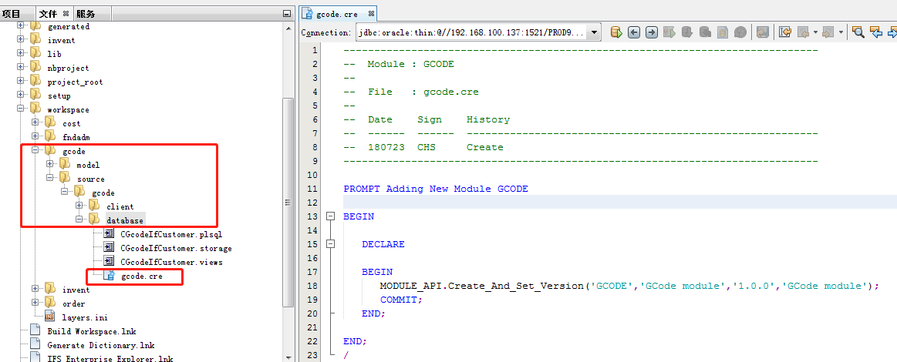
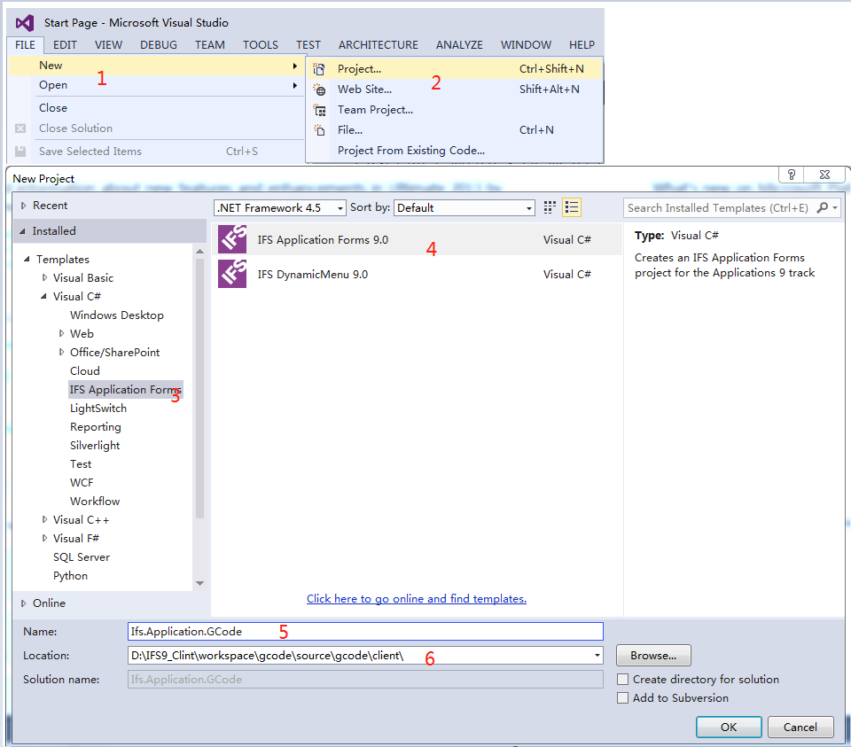
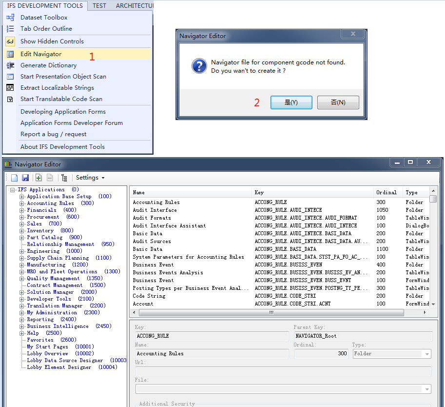
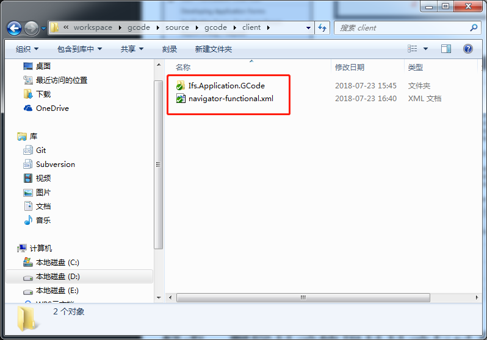
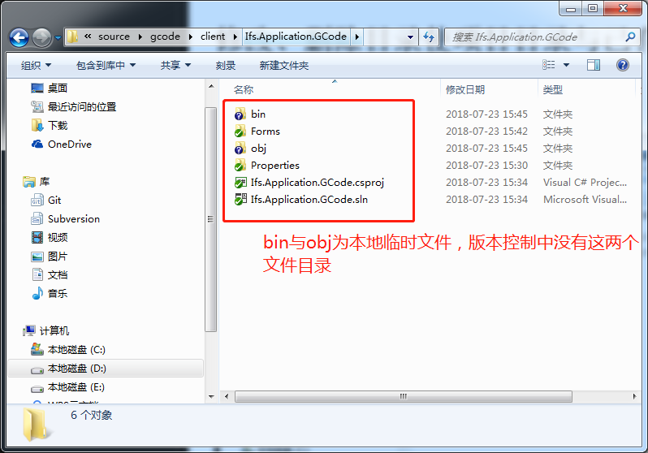

# 使用后台建模工具新建一个Component

________
# 新建修改deploy.ini文件

[Component]
Name=DHC

[ComponentName]
Description=Dalian Hi-think cust component

[ComponentType]
Type=Base


[Connections]
FNDBAS=DYNAMIC

[CapMergeFiles]


[CapMergeFilesLast]


[PostInstallationData]
# 将新建的Component信息写入到数据库中
新建cre文件，将如下代码写入到文件中，然后发布到数据库中
```
PROMPT Adding New Module GCODE
BEGIN
   DECLARE
   BEGIN
      MODULE_API.Create_And_Set_Version('GCODE','GCode module','1.0.0','GCode module');
      COMMIT;
   END;
END;
/
```

_____
# 建立所属Component的具体后台建模（略）
_____
# 生成前台开发workspace路径
将后台建模生成的workspace文件目录放入到前台代码的workspace中（如果前后台代码在一起可以跳过）,目录树如下
```
workspace
|---gcode
    |---source
        |---gcode
            |---client
```
_____
# 打开VS 2013建立新的IFS项目

_____
# 使用Navigator工具生成新的文件

_____
# 修改、删除目录使项目目录与已有Component目录类似
**workspace\gcode\source\gcode\client**

**workspace\gcode\source\gcode\client\Ifs.Application.GCode**

_____
# 按IFS中国提供的增加画面需要的10个步骤进行画面增加
